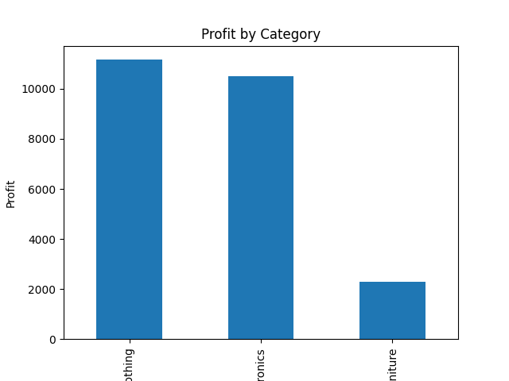
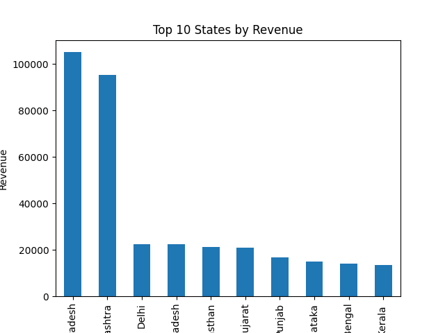
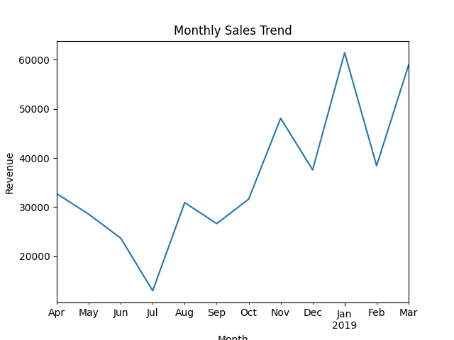

# 📊 Sales Data Analysis Project

## 📌 Overview

This project analyzes sales data to uncover insights about revenue, profit, and product performance.

## 📁 Dataset

The dataset includes:

* Orders data
* Order details
* Sales targets

## 🧹 Data Cleaning

* Removed missing values
* Ensured consistent formatting

## 📊 Key Insights

* Total Revenue: 431,502
* Total Profit: 23,955
* Clothing is the most profitable category
* Furniture is the least profitable category
* Highest sales come from Madhya Pradesh, especially Indore

## 📈 Visualization

The bar chart below shows profit by category:

### Profit by Category

### Revenue by State

### Monthly Sales Trend

## 💡 Business Recommendations

* Reduce operational costs to improve profit margins
* Focus on scaling Clothing category
* Improve marketing and pricing strategy for Furniture

## 🛠️ Tools Used

* Python
* Pandas
* Matplotlib

## 🚀 Author

Willy Kisiang'ani